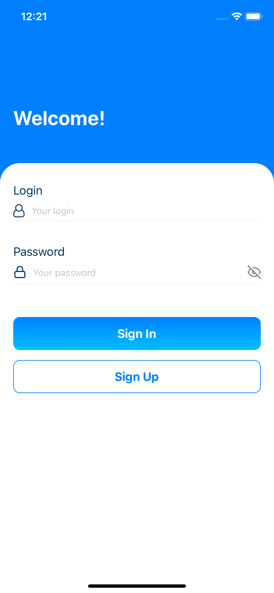
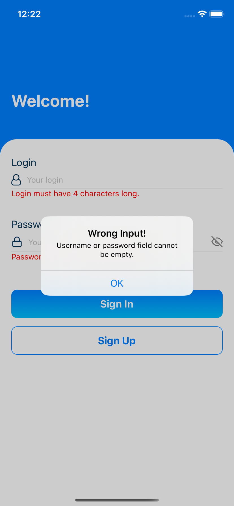

# react-native-mobile-app

# Project

My first project using react native following the tutorial by Pradip Debnath (https://www.youtube.com/channel/UC43N9Z8Fm0gg1Lgpw0eS9rg)

The project was changed to send a request to an api

# Images

Some images

